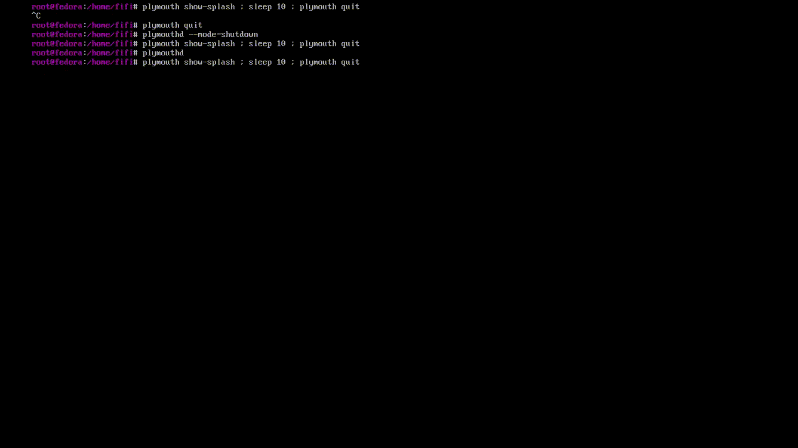

## Note on copyrighted assets
## All of the resources belong to Microsoft Corporation.
## "Windows Vista" is a registered trademark of Microsoft Corporation. The author(s) of this project are in no way affiliated with Microsoft, and are not endorsed by Microsoft in any way.
## "Windows 7" is a registered trademark of Microsoft Corporation. The author(s) of this project are in no way affiliated with Microsoft, and are not endorsed by Microsoft in any way.

# PlymouthVista
Re-creation of Windows Vista and Windows 7 boot screen and shutdown screen from its original assets. Designed to be used with [VistaThemePlasma](https://gitgud.io/catpswin56/vistathemeplasma), [AeroThemePlasma](https://gitgud.io/wackyideas/AeroThemePlasma).
Special thanks to [blacklightpy](https://github.com/blacklightpy) for the Vista boot screen code.

Special thanks to [catpswin56](https://gitgud.io/catpswin56/vistathemeplasma) for VTP and accepting my merge request that merges this theme to their repository.

This project is a fan-made labor of love that sees absolutely no profit whatsoever, donations or otherwise.

# Installation

You need `plymouth` and `plymouth-scripts` packages.
If you want to use Windows 7 variant of this theme, please make sure to install `ImageMagick` for generating blur effect on the shutdown screen.

You need `Segoe UI` and `Lucida Console` from a Windows installation. These fonts must be installed as system-wide fonts.

If you want to modify some of the text (eg. Show "Starting Linux" instead of "Starting Windows" on Windows 7 boot screen or make your own [Windows 9 boot screen](https://crustywindo.ws/w/images/2/2a/Dilshad9-Boot.png)). Make sure to check `./src/plymouth_config.sp` before running `compile.sh` for ease of finding the configuration section.

> [!WARNING]
> This theme is only tested on Fedora Linux and Arch Linux.

Copy this script for installation:
```sh
git clone https://github.com/furkrn/PlymouthVista
cd PlymouthVista
chmod +x ./compile.sh ; chmod +x ./install.sh
./compile.sh ; sudo ./install.sh
```

You might need to update initramfs again, if you persist flickering systemd messages at boot. Simply use `dracut --force --omit plymouth --regenerate-all --verbose`. *(At least on my system.)*

# Features

1- Vista boot:


2- 7 boot:


3- Shutdown & Reboot screens (Vista):


4- Shutdown & Reboot screens (7):


5- Windows boot manager (Password):


6- Windows Boot Manager (Question):
