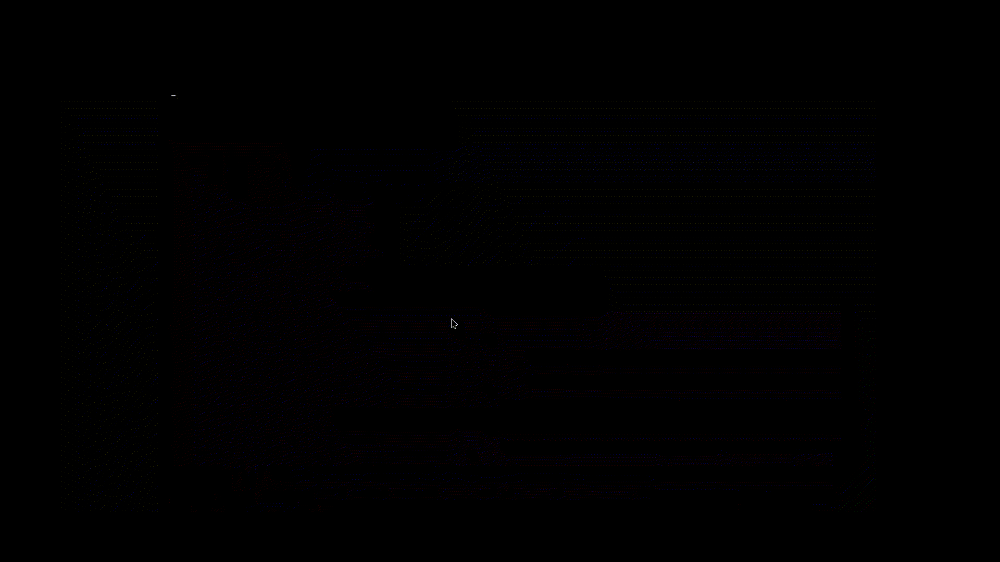

## Note on copyrighted assets
## All of the resources belong to Microsoft Corporation.
## "Windows Vista" is a registered trademark of Microsoft Corporation. The author(s) of this project are in no way affiliated with Microsoft and are not endorsed by Microsoft in any way.
## "Windows 7" is a registered trademark of Microsoft Corporation. The author(s) of this project are in no way affiliated with Microsoft and are not endorsed by Microsoft in any way.

# PlymouthVista
Re-creation of Windows Vista and Windows 7 boot screens and shutdown screens from their original assets. Designed to be used with [VistaThemePlasma](https://gitgud.io/catpswin56/vistathemeplasma) and[AeroThemePlasma](https://gitgud.io/wackyideas/AeroThemePlasma).

Special thanks to [blacklightpy](https://github.com/blacklightpy) for the Vista boot screen code.

Special thanks to [catpswin56](https://gitgud.io/catpswin56/vistathemeplasma) for VTP and accepting my merge request that merges this theme to their repository.

Special thanks to [wackyideas](https://gitgud.io/wackyideas) for ATP and accepting my merge request that adds this theme to their repository.

This project is a fan-made labor of love that sees absolutely no profit whatsoever, donations or otherwise.

# Preresiquites

## Required Packages:
You need `plymouth`, (`plymouth-scripts` and `plymouth-plugin-script` may be required, depending on your distro). 
Optionally you need `ImageMagick` for the Windows 7 variant.

*This section only covers distros that is available on AeroThemePlasma's installation guide.*
### Fedora: 
`sudo dnf install plymouth plymouth-scripts plymouth-plugin-script ImageMagick`
### Arch: 
`sudo pacman -S plymouth imagemagick`

## Required Fonts:

You need `Segoe UI` and `Lucida Console` from a Windows installation. These fonts must be installed as system-wide fonts.

These fonts are located on `C:\Windows\Fonts` in a Windows installation. You need `lucon.ttf` and `segoeui.ttf`. Make sure to copy these fonts from Windows 7 or Windows Vista for the best accuracy.

To install these fonts on your Linux machine,
- Create a new directory or select a directory on `/usr/share/fonts`,
- Copy `lucon.ttf` and `segoeui.ttf` to your selected created directory in `/usr/share/fonts`,
- Run `sudo fc-cache`

# Installation & Configuration:

Clone this repository first, simply use `git clone https://github.com/furkrn/PlymouthVista`

If you want to modify some of the text (e.g. show "Starting Linux" instead of "Starting Windows" on the Windows 7 boot screen or make your own [Windows 9 boot screen](https://crustywindo.ws/w/images/2/2a/Dilshad9-Boot.png)) make sure to check `plymouth_config.sp` which is located on `[Location that you've cloned PlymouthVista]/src/plymouth_config.sp` before running `compile.sh` for ease of finding the configuration section. Everything on configuration section is documented.

Make sure to make commands executable by simply running `chmod +x ./install.sh ; chmod +x ./compile.sh`

Run `./compile.sh` to generate `PlymouthVista.script` file. Then you are safe to run `./install.sh`.

> [!WARNING]
> This theme is only tested on Fedora Linux and Arch Linux.

Or simply copy this script below and run it:

```sh
git clone https://github.com/furkrn/PlymouthVista
cd PlymouthVista
chmod +x ./compile.sh ; chmod +x ./install.sh
./compile.sh ; sudo ./install.sh
```

# Features

1- Vista boot:


2- 7 boot:


3- Shutdown & Reboot screens & Update screen (Vista):

*The update screen does not contain the Windows Vista orb like the original one; implementing this feature on Plymouth isn't possible because there's no way that I can get the startup sound working.*


4- Shutdown & Reboot screens & Update Screen (7):


5- Windows boot manager (Password):


6- Windows Boot Manager (Question):

